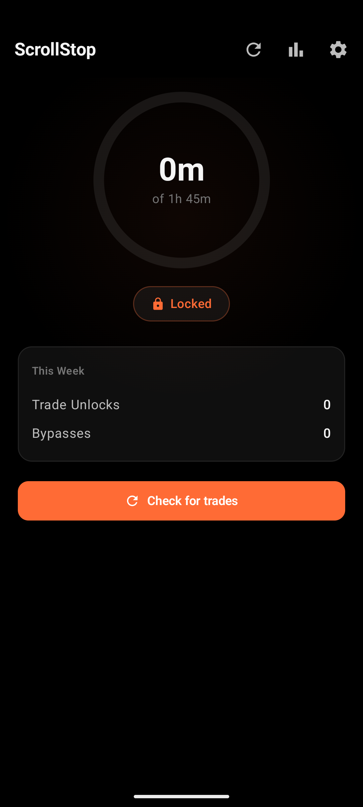
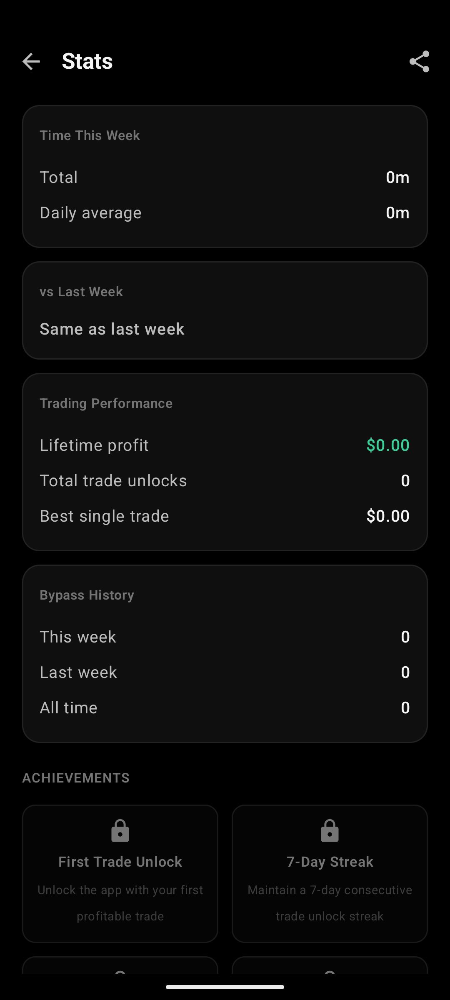

# ScrollStop

**Stop scrolling. Start trading.**

ScrollStop is an Android app that blocks social media after your daily time limit. The only way to unlock? Make a profitable crypto trade. Or type a shame phrase to bypass — your choice, your conscience.

<p align="center">
  
  &nbsp;&nbsp;
  
</p>

---

## How It Works

1. **Set your daily limit** — choose how many minutes per day you're allowed on social media
2. **Use your apps normally** — ScrollStop monitors usage in the background
3. **Hit your limit?** — a full-screen overlay blocks the app. No back button, no home button
4. **Make a profitable trade** on Binance or Solana to unlock for the rest of the day
5. **Or type the shame phrase** — *"I choose scrolling over making money"*

## Features

### Core
- Real-time usage tracking with foreground service
- Full-screen block overlay that captures Back/Home/Recents
- Binance spot + futures trade checking (HMAC-SHA256 authenticated)
- Solana DEX swap detection via Helius + Birdeye price APIs
- Phantom wallet deep link integration
- Configurable daily limits and profit thresholds
- Encrypted API key storage (AES-256-GCM)

### Stats & Gamification
- **Forced Profits Tracker** — lifetime earnings from trades you were forced to make
- **Stats Screen** — weekly usage, per-app breakdown, trading performance, bypass history
- **8 Achievements** — First Trade, 7-Day Streak, $1K Profits, Diamond Hands, and more
- **Streak Shields** — earn 1 shield per 7-day streak, auto-protects 1 missed day
- **Confetti Celebration** — particle animation + haptic when a qualifying trade is found

### Sharing & Notifications
- **Share Card** — export a branded stats image for social media
- **Smart Notifications** — approaching limit (80%), morning briefing, streak at risk (9pm), weekly summary

## Tech Stack

| Layer | Tech |
|-------|------|
| Language | Kotlin |
| UI | Jetpack Compose + Material 3 |
| Architecture | MVVM + Hilt DI |
| Database | Room (with type converters for LocalDate/Instant) |
| Networking | Retrofit + Moshi + OkHttp |
| Security | EncryptedSharedPreferences (AES-256-GCM) |
| Background | Foreground Service + WorkManager |
| Min SDK | 26 (Android 8.0) |

## Design

True black (#000000) background with a single electric orange (#FF6B35) accent. Mint green (#34D399) reserved for profit/money displays. Opal-inspired layout with generous whitespace, rounded glass cards, and clean typography hierarchy.

## Setup

### Prerequisites
- Android Studio (Arctic Fox+)
- JDK 17
- Android SDK 35

### Build

```bash
git clone https://github.com/oniani1/ScrollingStop.git
cd ScrollingStop
JAVA_HOME="C:/Program Files/Android/Android Studio/jbr" ./gradlew assembleDebug
```

### Permissions Required
- **Usage Access** — to monitor which app is in the foreground
- **Draw Over Apps** — to show the block overlay
- **Battery Optimization Exemption** — to keep the monitor service running

### Trading Setup (Optional)
- **Binance**: Create a read-only API key at [binance.com](https://www.binance.com/en/my/settings/api-management)
- **Solana**: Connect a Phantom wallet or paste your public address + get a free [Helius](https://helius.dev) API key

## Project Structure

```
app/src/main/java/com/scrollingstop/
├── data/
│   ├── achievements/    # Achievement definitions + checker
│   ├── db/              # Room database, DAOs, converters
│   ├── model/           # Entity classes
│   └── preferences/     # EncryptedSharedPreferences
├── di/                  # Hilt modules
├── service/             # Foreground service, overlay, workers
├── trade/
│   ├── binance/         # Binance API + HMAC auth
│   └── solana/          # Helius + Birdeye + Phantom
└── ui/
    ├── components/      # Shared GlassCard, GradientButton
    ├── dashboard/       # Main screen
    ├── navigation/      # NavHost routes
    ├── onboarding/      # 5-step setup wizard
    ├── overlay/         # Block screen + confetti
    ├── settings/        # App configuration
    ├── share/           # Share card generator
    ├── stats/           # Analytics + achievements
    └── theme/           # Colors, theme
```

## License

MIT

---

Built by [Nika Oniani](https://github.com/oniani1)
